# Agent design

A single tool-using agent on Amazon Bedrock. A deterministic application layer sits around it and owns identity, eligibility, memory and order confirmation. The model decides *what to do*. The application decides *what is allowed*.

## Diagram

```mermaid
flowchart LR
    subgraph Client["Browser (HTTPS)"]
        ID["Customer ID box<br/>(replaces login)"]
        TXT["Text chat"]
        MIC["Push-to-talk mic<br/>16 kHz PCM"]
        UI["Product cards, checkout summary<br/>Confirm button<br/>Home / Shop / Rewards / Basket"]
    end

    subgraph ECS["Amazon ECS Express Mode (Fargate + ALB, HTTPS)"]
        API["FastAPI<br/>session binds user_id"]
        STT["Speech-to-text"]
        TTS["Text-to-speech"]
        subgraph Agent["Companion agent (Converse tool loop)"]
            CTX["Context builder<br/>profile, activity insights, recommender picks,<br/>proactive signals, catalogue map,<br/>session + long-term memory, live basket"]
            LOOP["LLM reasoning<br/>plan, ask, recommend, cross-sell"]
            GATE{"Confirmation gate<br/>customer's own words<br/>or Confirm button"}
        end
        subgraph Tools["Tools"]
            DISC["search_products, get_recommendations,<br/>get_product_details, compare_products,<br/>get_complementary_products, get_customer_activity"]
            MEMT["update_customer_memory, present_options"]
            STARTER["Supplied starter functions<br/>get_basket, add_to_basket, update_basket,<br/>remove_from_basket, prepare_checkout, get_order"]
            ORDER["place_order to confirm_order<br/>(customer_confirmed=True set by app)"]
        end
        subgraph Data["Data and state"]
            TRAIN[("train: profiles<br/>relevant_items removed")]
            PROD[("products: catalogue")]
            INT[("interactions:<br/>Home / Shop / Rewards")]
            REC[("recommender output")]
            SIM[("simulation.sqlite<br/>baskets, quotes, orders")]
            MEM[("companion.sqlite<br/>conversation, summary,<br/>session + long-term memory,<br/>audit log")]
        end
    end

    BR["Amazon Bedrock<br/>Claude (primary), Nova (fallback)"]
    TR["Amazon Transcribe<br/>streaming"]
    PO["Amazon Polly<br/>neural voice"]

    ID --> API
    TXT --> API
    MIC --> STT --> TR
    TR --> STT --> API
    API --> TTS --> PO
    API --> CTX --> LOOP
    LOOP <--> BR
    LOOP --> DISC & MEMT & STARTER
    LOOP --> GATE --> ORDER
    UI -- "Confirm order" --> ORDER
    DISC --> PROD & INT & REC & TRAIN
    STARTER --> SIM
    ORDER --> SIM
    MEMT --> MEM
    CTX --> MEM & TRAIN & INT & REC
    API --> UI
```

A rendered copy is in `docs/agent-design.svg` (regenerate with `npx @mermaid-js/mermaid-cli -i docs/agent-design.mmd -o docs/agent-design.svg`).

## Turn lifecycle

1. **Identify.** The first page takes a `user_id`. Unknown IDs get *"We couldn't find customer ID … enter a valid one."* The ID is stored in the session and bound to every tool call. The model never supplies it.
2. **Load memory for that customer only.** This covers the conversation history, the rolling summary, session memory and long-term memory. A per-customer lock prevents two turns from interleaving.
3. **Confirmation check (deterministic).** If a checkout summary from an earlier turn is pending and the customer's own message is an unconditional "yes, place the order", the turn is flagged as confirmed. "Remove that item before placing the order", "yes but…" and questions are *not* confirmations.
4. **Build context.** The system prompt is rebuilt on every model call, so it always shows the latest basket, budget and rejections:
   - sanitized profile
   - behaviour insights (top categories, recent views, open cart items, purchases, Rewards activity)
   - eligible recommender picks
   - data-driven proactive signals
   - catalogue map (domains, categories, price ranges)
   - memory and live basket
5. **Tool loop.** The model calls tools until it answers. Every tool result is structured `{ok, data | error{code,message}}`, so failures are explained rather than hidden.
6. **Persist and compact.** Memory is saved. When the history passes `MAX_HISTORY_MESSAGES`, older turns are folded into a summary at a clean turn boundary.
7. **Respond.** The response carries the reply text, product cards, checkout summary, order and an action log. For voice turns the reply is short and read aloud by Polly.

## Tools

| Tool | Purpose | Key guarantees |
|---|---|---|
| `search_products` | Discovery with category, keyword, price, quality and tag filters | Eligibility via the starter's `Store.product` (region, OS, launch date, owned). Final prices use the starter's rounding. Rejected items are excluded. The stated budget is applied automatically. Hidden-ineligible counts are reported. |
| `get_recommendations` | Recommender output first, topped up by the profile/history scorer | Only eligible items within constraints. The source is labelled. |
| `get_product_details`, `compare_products` | Facts and side-by-side comparison | Highlights the cheapest, highest-quality and best-fit option. |
| `get_complementary_products` | Cross-sell | Uses category lift from same-day shopping missions in `interactions`, with a pairing map as fallback. Stays budget-aware and priced below the base item. Respects marketing opt-in. |
| `present_options` | Registers the exact ordered list shown to the customer | Makes "the first option" resolvable. Renders cards. |
| `update_customer_memory` | Goal, budget (per item or total), preferences, dislikes, rejections | Also written to long-term memory. |
| `get_customer_activity` | Detailed Home/Shop/Rewards history | |
| Starter: `get_basket`, `add_to_basket`, `update_basket`, `remove_from_basket`, `prepare_checkout`, `get_order` | Unmodified supplied functions via `tool_adapter.call_tool` | Original schemas from `tool_schemas.json`. A basket change voids a pending summary. |
| `place_order` | Asks the app to place the order | Refused unless a summary from an earlier turn is pending **and** the confirmation gate passed. The app then calls the starter's `confirm_order(customer_confirmed=True)`. |

`confirm_order` is never model-visible, as the starter README requires. The **Confirm order** button calls it directly through `/api/checkout/confirm` without involving the model.

## Memory and context

| Layer | Contents | Lifetime |
|---|---|---|
| Conversation | Converse-format history plus a clean UI transcript | Until "New chat" |
| Rolling summary | LLM summary of older turns (budgets, rejections, products, orders) | Until "New chat" |
| Session memory | Goal, budget and scope, preferences, dislikes, rejected products with reason, the last 4 presented option lists, pending checkout, last order, basket-panel actions | Until "New chat" |
| Long-term memory | Preferences, dislikes, past goals, orders | Persists per customer |
| Starter store | Basket, checkout quotes, orders | Persists per customer |

Every layer is keyed by `user_id`, so switching customers loads a different, isolated context. Voice and text write to the same layers, which keeps context consistent across channels.

## Personalisation signals

- **Profile:** region, device OS, household size, quality preference, monthly budget, interests, marketing opt-in and owned items.
- **Interactions:** category affinity weighted by event type (purchase > cart > wishlist > reward > view), open cart items, recent purchases, Rewards activity and same-day category co-occurrence.
- **Recommender output:** rank bonus, always subordinate to the current request and constraints.
- **Session:** the stated budget, preferences and rejections override the profile.

Every recommendation carries a human-readable reason, for example "ranked #2 by your recommender", "matches the quality level you usually prefer" or "15% off right now".

## Mapping to the evaluation criteria

| Criterion | Where it is addressed |
|---|---|
| Understanding and personalization (25%) | Context builder, personalised scorer, reasons on every card, follow-up questioning rules |
| Agent design and tool execution (20%) | Tool loop, structured tool errors, visible action log, confirmation gate, checkout invalidation |
| Memory and context (20%) | Four memory layers, `present_options` references, budget and rejection memory, summarisation, per-customer isolation |
| Proactive engagement and cross-selling (15%) | Proactive signals (open cart, offers, complements), greeting, one complementary suggestion after an add, opt-in respected |
| Voice, text and usability (10%) | One conversation for both channels, Transcribe and Polly with browser fallbacks, cards, Confirm button, mobile layout |
| Accuracy and reliability (10%) | Prices and eligibility come only from the starter logic. Explicit unavailability reasons. Subscription block explained. Model fallback. The turn never crashes. |
